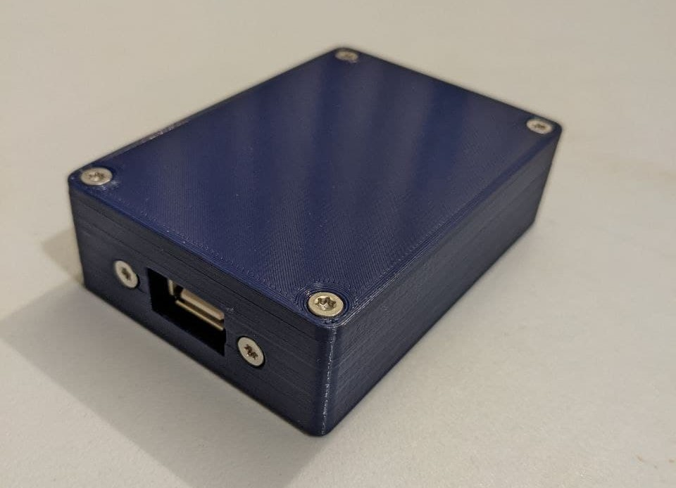
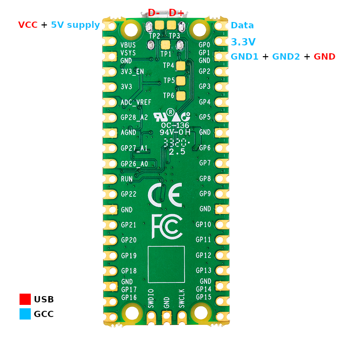
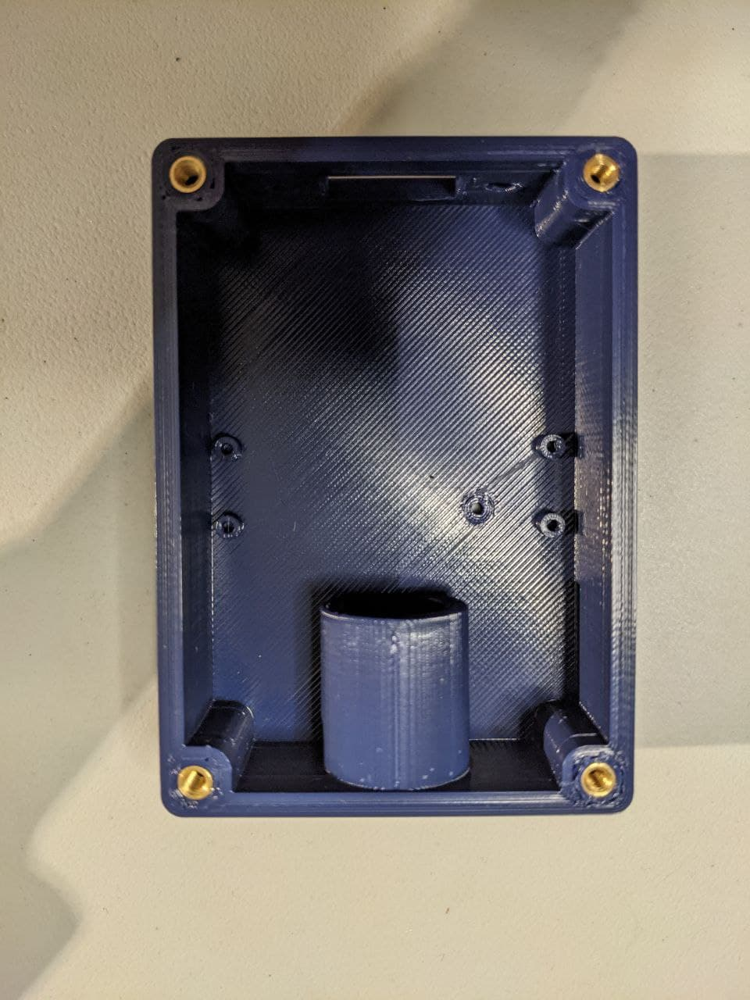
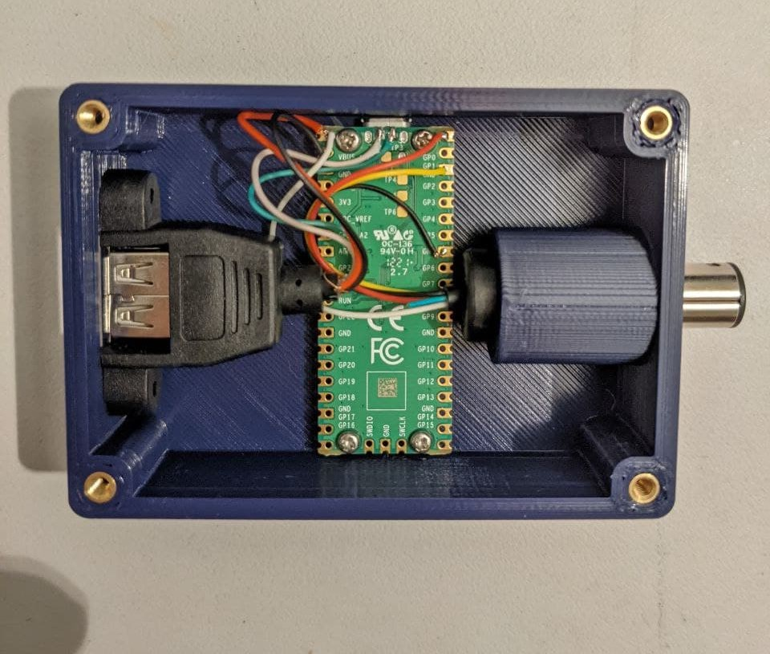
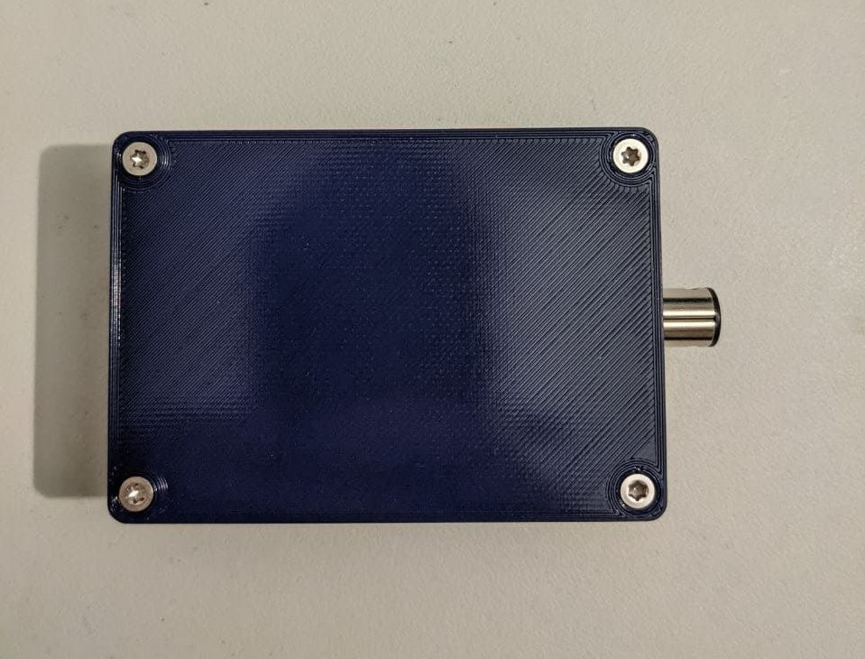

# GameKeeb

Keyboard to GameCube adapter powered by Raspberry Pi Pico

## Introduction

Someone asked me if I could make them a keyboard to GameCube adapter for
competing in Super Smash Bros Melee. I had the idea to make one using the
Raspberry Pi Pico, because it natively operates at 3.3V supply voltage and logic
level, and it has USB host support built in. Additionally, Arte had already
developed the awesome
[pico-rectangle](https://github.com/JulienBernard3383279/pico-rectangle)
firmware, so I forked it and modified it to read keycodes from a USB keyboard
instead of just GPIO inputs.

Bear in mind that USB host implementation is not as simple as it sounds, and the current
firmware is not guaranteed to work with every keyboard. In particular, it may not support all NKRO (N-Key rollover) keyboards. It should work fine with any keyboard that supports the HID boot protocol, which is very common keyboard and usually recognisable by your keyboard having 6KRO. Many NKRO keyboards will fall back to boot protocol when needed anyway. You can test your key rollover at http://gadzikowski.com/nkeyrollover.html. Support for different keyboards will be further improved in the future.

I do sell these fully assembled, so email me or [join my Discord](https://discord.com/invite/PreBbFgxxY)
if you're interested. As stated above, I cannot guarantee compatibility with
every keyboard, so I accept returns for a full refund (not including
shipping costs).

## Parts used

| Part name                            | Amount | Link                                                                                                       |
|--------------------------------------|--------|:----------------------------------------------------------------------------------------------------------:|
| USB A panel mount                    | 1      | https://www.ebay.co.uk/itm/231984473033 (alternatively https://www.aliexpress.com/item/32573641881.html)   |
| GameCube controller extension cable  | 2      | https://www.ebay.co.uk/itm/193842724956 (alternatively https://www.aliexpress.com/item/4000505687571.html) |
| M3 threaded insert, M3 X D4.0 X L5.2 | 4      | https://www.ebay.co.uk/itm/264096317255                                                                    |
| M3x6mm countersunk machine screw     | 6      | https://www.ebay.co.uk/itm/222414700032                                                                    |
| M2x4mm self-tapping screw            | 4      | https://www.ebay.co.uk/itm/383054906364?var=651662203885                                                   |
| Raspberry Pi Pico                    | 1      | https://shop.pimoroni.com/products/raspberry-pi-pico?variant=32402092294227                                |
| Case                                 | 1      | [3D printed](case_files/)                                                                                  |

## Printing the case

The STL files for the case are [included](case_files/) in this repository. I
print them without supports at 0.2mm layer height. It's an easy print and
shouldn't require any special settings.

## Assembly instructions

1. Cut and strip the male end of the GameCube controller extension cable and the
   female end of the USB panel mount. You should strip the outer casing all the
   way up to the connector otherwise it will stick out too much.

2. Use a knife to slice/scrape off the two bumps/ridges on the top of the GameCube
   connector. This is necessary for it to fit in the slot in the case. Some cables may not have these, in which case you can ignore this step.

3. Solder the USB panel mount and the GameCube controller connector to the Pico
   following the wiring diagram below.

The USB colour coding is standard and can easily be found online. The GCC colour coding is only standard for official cables
(i.e. cables in actual GameCube controllers). The official colour coding can be
found [here](http://int03.co.uk/crema/hardware/gamecube/gc-control.html).

Based on my testing, the colour coding for the type of extension cable I have
linked is as follows:

- Pin 1 (5V supply): White
- Pin 2 (Data): Red
- Pin 3 (GND1): Black
- Pin 4 (GND2): Yellow
- Pin 6 (3.3V supply): Green

This is not guaranteed to be the same for other cables, and could even vary for
these cables for all I know. You can test it yourself by using a multimeter to
test continuity on the female connector (meaning you would have to strip the
wires on the female connector as well).

Note that these wires are thin enough that you can fit multiple wires into the
pin holes. I take advantage of this to make the wiring simpler. If you have
trouble fitting them you can use any other GND though. There are plenty of them
in convenient locations.

It also is advisable to use kapton tape or some other means of insulation to
prevent any potential shorts between the D+ and D- wires.

4. Prepare the case by inserting threaded inserts. This is done by inserting
   them into the holes and heating them with a soldering iron at around 220C.
   You shouldn't need to push them in. Just let gravity do the work.

5. Insert the GameCube connector into the GameCube connector slot.

6. Secure the Pico to the standoffs using the M2x4mm self-tapping screws. Be
   careful not to over-tighten them or break the standoffs.

7. Mount the USB panel mount connector using 2 M3x6mm screws.

8. Screw the lid onto the case using 4 M3x6mm screws and making sure that the
   locking piece does not crush any of the wires inside the case.

## Firmware flashing instructions

Now that the assembly is complete, you can flash the firmware. Actually you
should probably have done this beforehand to make sure the microcontroller
works. Anyway...

1. Connect the Pico to your PC via USB while pressing the bootsel button. If you
   have already completed the assembly, you can achieve this by sticking a
   paperclip into the tiny hole in the bottom of the case.

2. The Pico should show up as a flash drive on your PC. Drop the firmware .uf2
   file onto it and it will reprogram itself automatically.
